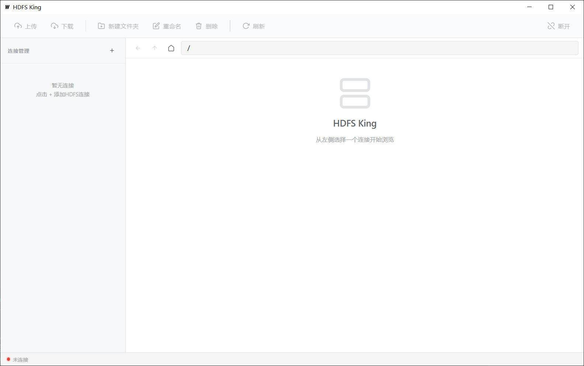

# HDFS King

一个类似 Windows 资源管理器的 HDFS 可视化管理工具，基于 [Wails v2](https://wails.io) + Go + 原生前端构建。



## 功能特性

- **连接管理** — 添加、编辑、删除多个 HDFS 集群连接，配置持久化到本地
- **文件浏览** — 类 Explorer 界面浏览 HDFS 目录，支持双击进入、后退、上级导航
- **文件操作** — 上传、下载、新建文件夹、重命名、删除
- **路径导航** — 地址栏直接输入路径跳转，支持键盘快捷键
- **右键菜单** — 文件/空白区域右键弹出操作菜单
- **状态栏** — 实时显示连接状态、当前目录文件数量统计

## 快捷键

| 快捷键 | 功能 |
|--------|------|
| `F5` | 刷新当前目录 |
| `F2` | 重命名选中项 |
| `Delete` | 删除选中项 |
| `Backspace` | 返回上级目录 |
| `Enter`（地址栏） | 跳转到输入路径 |

## 技术栈

- **后端**: Go + [colinmarc/hdfs](https://github.com/colinmarc/hdfs) 客户端库
- **前端**: 原生 JavaScript + CSS（无框架），Vite 构建
- **桌面框架**: [Wails v2](https://wails.io)

## 开发

### 前置条件

- Go 1.23+
- Node.js 18+
- Wails CLI v2 (`go install github.com/wailsapp/wails/v2/cmd/wails@latest`)

### 运行开发模式

```bash
wails dev
```

### 构建生产版本

```bash
wails build
```

构建产物：`build/bin/hdfs-king.exe`

## 项目结构

```
├── backend/                 # Go 后端服务
│   ├── models.go            # 数据模型
│   ├── connection.go        # 连接管理（增删改查 + 持久化）
│   └── hdfs_service.go      # HDFS 文件操作服务
├── frontend/                # 前端资源
│   └── src/
│       ├── main.js          # 主应用逻辑
│       └── style.css        # 样式
├── main.go                  # Wails 应用入口
├── app.go                   # App 结构体
└── wails.json               # Wails 项目配置
```

## 配置存储

连接配置文件保存在 `~/.hdfs-king/connections.json`。

## License

[LICENSE](LICENSE)